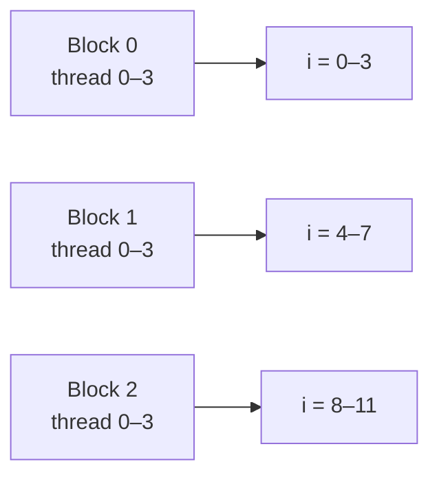

# GPU / CUDA 学习笔记

## GPU Puzzle 1：Map

```python
i = cuda.blockIdx.x * cuda.blockDim.x + cuda.threadIdx.x
```

- `out`：输出数组。


```mermaid
flowchart LR
    B0["Block 0<br/>thread 0–3"] --> I0["i = 0–3"]
    B1["Block 1<br/>thread 0–3"] --> I1["i = 4–7"]
    B2["Block 2<br/>thread 0–3"] --> I2["i = 8–11"]
```
